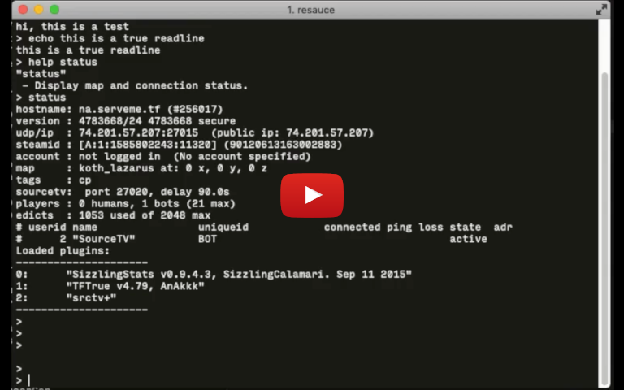
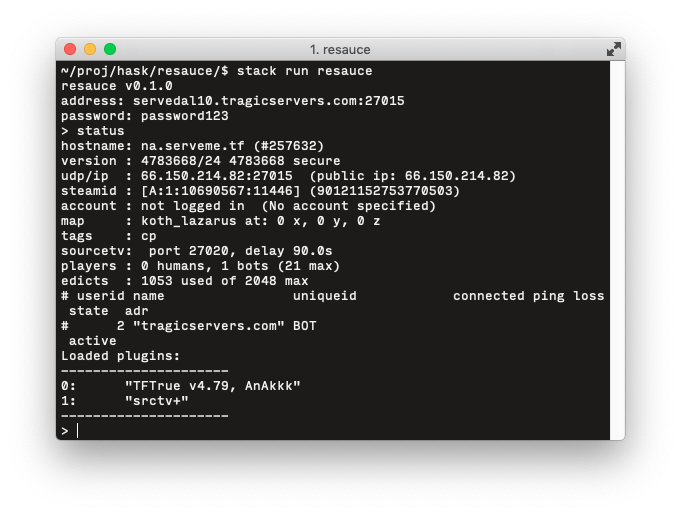

resauce is an implementation of the Source engine [remote console (RCON) protocol](https://developer.valvesoftware.com/wiki/Source_RCON_Protocol) in Haskell.

## Status

The screenshot shows resauce connected to a TF2 server, showing the results of issuing a `status` command.

A [demo screencast](https://youtu.be/CGSiGx1BcgE) is available.

### Features:
- Full-featured readline interface
- Handling of multi-packet responses

### Planned Features:
- Better handling of missing ip and/or password
- Better command-line interface

## Building
resauce uses [Haskell stack](https://docs.haskellstack.org/en/stable/README/). After installing it, run `stack install`.

P.S. The Haskell readline library has had issues building in the past, see an example solution to the issue in [./install_readline.sh](install_readline.sh).

## Manual
Use `stack run resauce` to run the application.

Usage: `$ resauce [ip[:port]] [password]`
